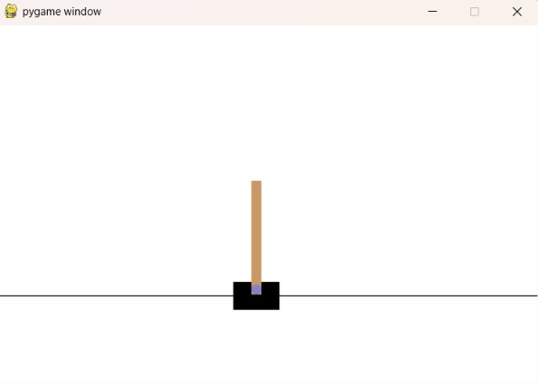
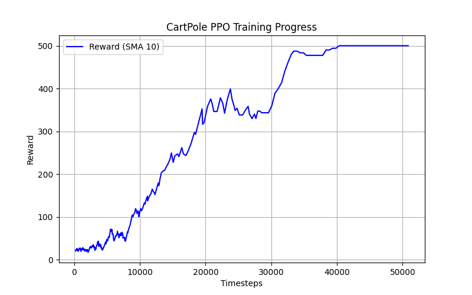

# PPO CartPole-v1 Reinforcement Learning

## Project Overview

This project implements the **Proximal Policy Optimization (PPO)** reinforcement learning algorithm to solve the **CartPole-v1** environment using **Gymnasium** and **Stable-Baselines3**. The trained agent learns to balance a pole on a moving cart by maximizing cumulative rewards.

---

## Demo



## Learning Curve



## Features

- PPO-based reinforcement learning agent
- Model evaluation over multiple episodes
- Live visualization of the trained agent
- Pre-trained PPO model included
- Learning curve generation
- Evaluation report generation

---

## Project Structure

```
CartPole/
│── train.py               # Train the PPO agent
│── evaluate.py            # Evaluate the trained model
│── test.py                # Visualize the trained model
│── ppo_model.zip          # Saved trained model
│── learning_curve.png     # Training performance graph
│── evaluation_report.txt  # Evaluation results
│── requirements.txt       # Project dependencies
│── README.md              # Project documentation
```

---

## Technologies Used

- Python
- Stable-Baselines3
- Gymnasium
- PyTorch
- Matplotlib

---

## Installation

### Clone the repository

```bash
git clone https://github.com/Chedgeprathm/CartPole.git
cd CartPole
```

### Create a virtual environment

```bash
python -m venv venv
```

### Activate the virtual environment

**Windows**

```bash
venv\Scripts\activate
```

### Install dependencies

```bash
pip install -r requirements.txt
```

---

## Usage

### Train the model

```bash
python train.py
```

### Evaluate the model

```bash
python evaluate.py
```

### Run the trained agent

```bash
python test.py
```

---

## Output

- Trained PPO model (`ppo_model.zip`)
- Learning curve (`learning_curve.png`)
- Evaluation report (`evaluation_report.txt`)
- Live CartPole simulation